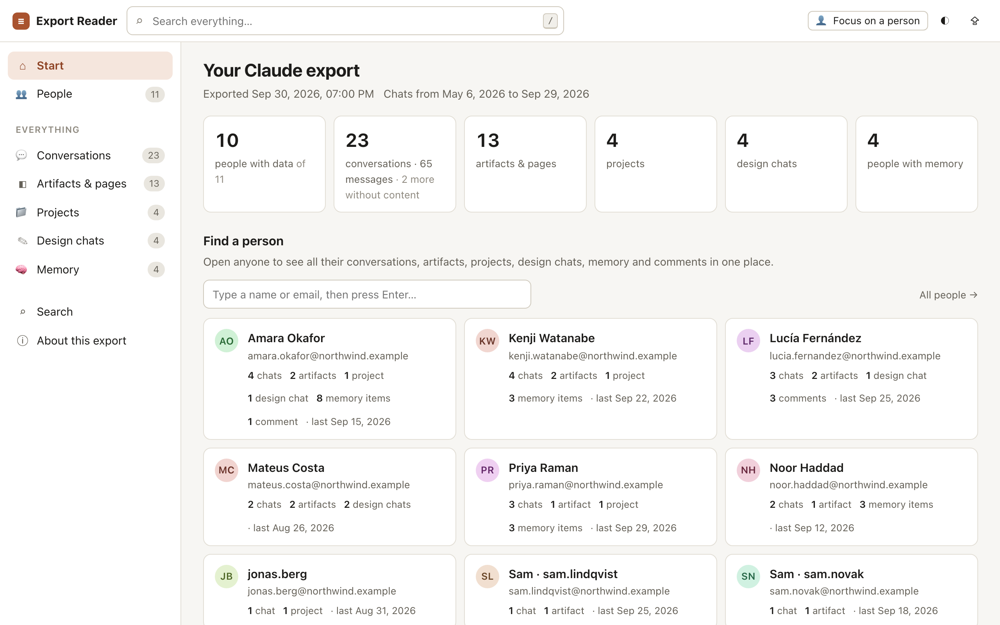
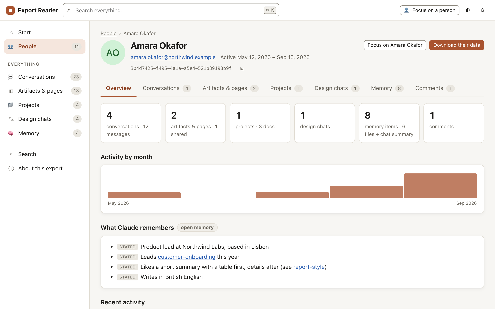
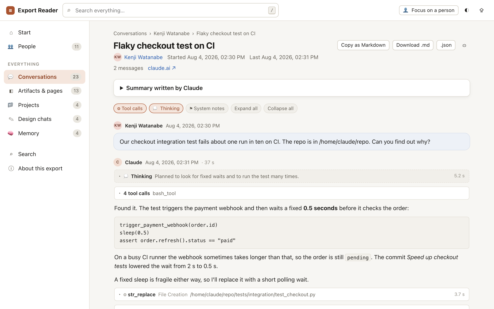
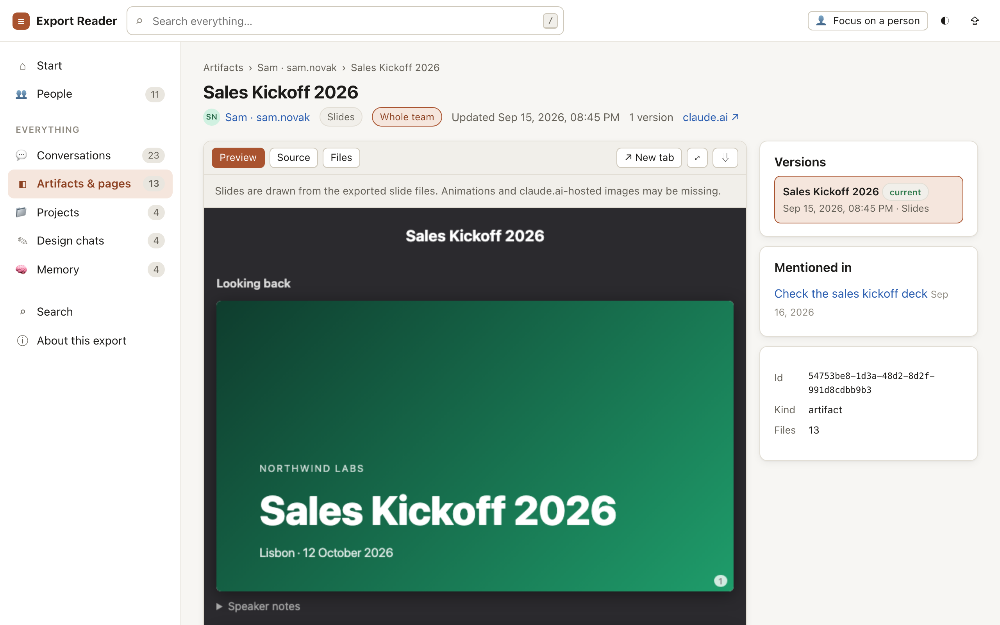

# Claude Export Reader

Open a Claude team data export in your browser and browse it person by person. One HTML file, works offline, nothing is uploaded.

[](https://github.com/PiniShv/AnthropicReader/actions/workflows/ci.yml)
[](LICENSE)

## Why

When a Claude Team workspace asks for a data export, you get a pile of zip files and a JSON manifest. Inside are very large JSON files, many artifact folders and lots of small files. Reading them by hand is slow, and it is hard to answer simple questions such as "what did this person do with Claude?".

Claude Export Reader turns the export into a browsable site, inside one browser tab:

- every **person** in the workspace, with all their data in one place
- every **conversation**, **artifact**, **project**, **design chat** and **memory**
- full-text **search** across all of it

It is a single HTML file. You can keep it next to the export, send it to a colleague, or open it on a laptop with no network.

## Screenshots

All screenshots show made-up sample data (the built-in "Try it with sample data" export for the fictional company Northwind Labs). No real export data is shown.

| Start page | Person page |
|---|---|
|  |  |

| Conversation | Artifact |
|---|---|
|  |  |

## Quick start

1. **Get the reader.** Download `claude-export-reader.html` from the [latest release](https://github.com/PiniShv/AnthropicReader/releases/latest). For the newest, not yet released version, download [`dist/claude-export-reader.html`](https://github.com/PiniShv/AnthropicReader/raw/main/dist/claude-export-reader.html) from this repository instead (right-click the link and choose **Save Link As…**).
2. **Open it.** Double-click the file. It opens in your browser from disk; no server is needed.
3. **Load the export.** Drag all the export `.zip` files onto the page, or click **Choose files…**. You can also click **Choose a folder…** and pick a folder that holds the zips, or the folders your computer made when it unzipped them.

No export at hand? Click **Try it with sample data** on the start page. It loads a small, made-up export so you can look around.

**Check the download (optional).** Each release also has a `claude-export-reader.html.sha256` file. Save it in the same folder as the reader and run `sha256sum -c claude-export-reader.html.sha256` (on macOS: `shasum -a 256 -c claude-export-reader.html.sha256`). It prints `OK` when your file is exactly the one the release published. On Windows, run `Get-FileHash claude-export-reader.html` in PowerShell and compare the hash with the one in the `.sha256` file.

The release workflow also signs a build provenance attestation for the reader: a signed record of the workflow run that built the file and the commit it came from. The workflow publishes only commits that are on `main`. With the [GitHub CLI](https://cli.github.com/), check it in the folder where you saved the file:

```bash
gh attestation verify claude-export-reader.html --repo PiniShv/AnthropicReader --signer-workflow PiniShv/AnthropicReader/.github/workflows/release.yml
```

It fails if the file was changed, or if this release workflow did not build it.

### Which files to load

The export email has one link per part, plus a `manifest-….json` file:

| File | What it holds |
|---|---|
| `conversations-000.zip` | All chats. Usually the biggest data file. |
| `light_metadata-000.zip` | The people list (`users.json`: names and emails). Without it you see account ids only. |
| `projects-000.zip` | Projects with their knowledge files. |
| `memories-000.zip` | What Claude remembers about each person. |
| `design_chats-000.zip` | Claude Design chats. |
| `frames-000.zip`, `frames-001.zip`, … | Published artifacts and Claude Docs pages, with their saved versions. |
| `manifest-….json` | The list of parts and their download links. |

You can load any subset. Missing parts show up as empty sections. Keep the tab open while you browse: big files are read on demand, so do not move or delete them meanwhile.

**Only have the manifest?** Drop the `manifest-….json` on its own. The page lists every part with a **Download** button. The links come from the manifest. They work for 24 hours after the export was made, may work only once, and need you to be signed in to claude.ai in the same browser. If you later load only some parts, the start page says which parts are missing, and **About this export** offers their download links.

## Features

- **People first.** The start page has a person finder. Each person page has tabs for Conversations, Artifacts & pages, Projects, Design chats, Memory and Comments, each with a count, so an empty tab is visible, not hidden. People who left the team still appear, marked "not in users.json". Items with no owner (for example agent-made artifacts and empty design chats) are listed under "No owner".
- **Focus mode.** Click **Focus on a person** (on their profile, or 👤 in the top bar). Every list, count and search is then limited to that person until you click **Show everyone**.
- **Conversations** look close to claude.ai:
  - edited and regenerated messages as **branches**, with `‹ 1 / 2 ›` switchers
  - **tool calls** with input and result, grouped when there are many, with errors marked
  - **thinking** blocks and their summaries, collapsed by default
  - web search **citations** as numbered source links
  - files, artifacts, widgets and drafts Claude made, in a "What Claude produced here" box
  - uploaded text files, and the names of uploaded images and PDFs
  - copy as Markdown, download as `.md` or the original `.json`, print, and copy a link to one message
- **Artifacts** with every saved **version**:
  - HTML artifacts, single-file and multi-file (images, scripts and stylesheets are wired up from the export)
  - **Slides** decks drawn slide by slide, with speaker notes
  - **Design** canvases, one board at a time, with a board picker
  - **Claude Docs** pages with their tabs and comment threads
  - comments on artifacts, preview, source and file views, open in a new tab, full screen and download
- **Projects** with instructions, knowledge files (Markdown rendered, HTML in a safe preview) and the related memory.
- **Design chats** from Claude Design, with tool calls, attachments, question forms and their answers, and file changes per turn.
- **Memory**: memory files grouped by folder, the chat memory summary and project memories. `[[links]]` between memory files work.
- **Search** across people, conversations, artifacts, projects, design chats and memory. Use quotes for exact phrases. Tick **Deep search** to also look inside tool calls, thinking, attached files and the content of artifacts. Press `Ctrl+K` (`⌘K` on a Mac) to jump to the search box.
- **Download one person's data** as a single `.zip`: conversations as Markdown and JSON, artifacts, projects, design chats, memory and comments.
- **Manifest download links** for parts you have not loaded yet.
- **Older export formats** work too (`projects.json`, `memories.json`, chats without branches). You can **load several exports together**: when the same item is in two exports, the newer copy wins.
- **Dark mode** (follows your system; ◐ switches it), **right-to-left** text such as Hebrew and Arabic, and a layout that works on **phones and tablets**.
- **Keyboard and screen readers.** Everything works with the keyboard alone. A skip link leads to the content, the focus moves to the heading of each new page, and the page follows the system setting for less motion. The aim is WCAG 2.2 level AA: the sample data passes the automated axe-core and keyboard checks (`npm run a11y`) in light and dark mode.
- **Reopen last export** in desktop Chrome and Edge: the page remembers which files you picked (not their content) and can open them again after a reload.

## Privacy and security

The export holds personal data: names, emails, phone numbers and everything people wrote to Claude. The reader is built so that this data stays on your computer.

- **Everything stays in the tab.** Files are read with browser APIs and parsed in memory. Nothing is sent anywhere. Close the tab and the data is gone from memory.
- **No network requests of its own.** The reader has no analytics, no fonts or scripts from a CDN, and no "phone home". It works with the network turned off.
- **Untrusted content is isolated.** Text from the export (Markdown in messages, docs, memory and comments) is cleaned with [DOMPurify](https://github.com/cure53/DOMPurify) before it is shown. HTML artifacts, widgets and HTML project files run in sandboxed iframes **without** `allow-same-origin`, so they cannot read the reader, your files or other artifacts. Inside their sandbox they may still load their own fonts, images or scripts from the internet, exactly as they did on claude.ai.
- **Remote images are not loaded.** Images in Markdown text (`` and `` tags) become plain links that you can open yourself.
- **Manifest links stay in memory.** The single-use download links from the manifest are kept only in memory. They are never saved, logged or fetched by the page. They are shown only as **Download** buttons that you click.
- **What the browser stores.** Only small settings: the theme, conversation view options, the person you focused on (for this tab only), and, in Chrome and Edge, file handles for **Reopen last export**. Export content is never stored.

See [SECURITY.md](SECURITY.md) for the full privacy model and how to report a vulnerability.

## What the export does not contain

These are limits of the export itself, not of the reader:

- **Uploaded files.** Images, PDFs and screenshots appear only as names. Text files people pasted or attached are included.
- **Files made by code.** Spreadsheets, PDFs and other binary files Claude produced while running code are listed by name only.
- **A link between conversations and projects.** A project page cannot list its chats.
- **Data that lived on claude.ai.** Some artifacts use shared storage, images hosted on claude.ai or other live features. Those parts are missing, and the reader shows a notice.
- **Old versions.** Artifacts seem to keep only their latest 20 versions. Claude Docs pages keep only the current text.
- **Some details of Claude Design chats.** Tool output is cut to 200 characters in newer chats, and thinking text is empty.
- **Hidden thinking.** For some messages only the thinking summary is exported, not the full text.
- **Who an artifact was shared with.** Only the number of viewers and editors is exported. People who comment on someone else's artifact are anonymous.

## Browser support

Recent versions of **Chrome, Edge, Firefox and Safari** on desktop and mobile.

- **Zip files** are unpacked with the browser's built-in `DecompressionStream('deflate-raw')`. That needs Chrome or Edge 103, Firefox 113 or Safari 16.4 (macOS, iOS and iPadOS), or newer. An older browser says so when you pick a zip. Then unzip the files first and choose the folder, or use a newer browser. Unzipped folders and the sample data should also work in somewhat older browsers (about Chrome 92, Firefox 90 and Safari 15.4), but those are not tested.
- **Phones and tablets:** choose the `.zip` files. Picking a folder works only on desktop, and drag and drop may not be available.
- **Reopen last export** and the faster file pickers need the File System Access API, which only desktop Chrome and Edge have (Brave turns it off by default). Other browsers use the normal file picker.

## Development

You need **Node.js 20 or newer**. There are **no npm dependencies**: no `npm install` step, no bundler.

```bash
npm run build
```

Writes `dist/claude-export-reader.html` from the sources.

```bash
npm test
```

Runs the tests in `test/` with Node's built-in test runner.

```bash
npm run build:check
```

Fails if the committed `dist/` file is out of date. CI runs this.

```bash
npm run demo
```

Runs `scripts/make-demo-export.mjs`. It writes the made-up sample export (six zip parts and a manifest, like a real download) to `demo/`, so you can try the reader on real files. `npm run demo -- <folder>` writes them somewhere else.

### Project layout

```text
src/
  template.html      page skeleton (landing screen and app shell)
  styles.css         all styles, light and dark
  zip.js             zip reader (and the small zip writer for downloads)
  load.js            file picking, drag and drop, streaming JSON parser
  render.js          escaping, Markdown, sanitizing, formatting helpers
  ui.js              app state, the lifetime of one drawn page, on(), blk(), preHtml()
  model.js           the in-memory model: people, links and derived data, queries
  ingest.js          classifies files and reads each record into the model
  conversation.js    message tree, branches, tool helpers, outputs
  search.js          search engine and its index
  export.js          Markdown export and the per-person zip
  preview.js         artifact previews: inlined files, Slides, Design boards
  views.js           kind registry, router, sidebar, tables, start page, people, person page
  views-conv.js      conversation list and thread view
  views-art.js       artifact list and page, versions, Docs pages
  views-design.js    design chat list and thread
  views-misc.js      projects, memory, search page, about, download dialog
  demo.js            the made-up sample export: helpers, people and packaging
  demo-chats.js      sample conversations
  demo-records.js    sample projects, memory and design chats
  demo-artifacts.js  sample artifacts
  app.js             start-up, loading screen, routing, global events
vendor/              marked and DOMPurify, vendored (see THIRD_PARTY_NOTICES.md)
scripts/             build, sample export and maintainer checks (snapshot, accessibility, screenshots, vendor)
test/                tests (node --test)
dist/                the built single-file reader (committed)
docs/                export format reference, architecture notes, screenshots
```

### How the build works

`scripts/build.mjs` reads `src/template.html` and puts everything inline:

1. `src/styles.css` replaces the `/*__STYLES__*/` marker.
2. The two vendored libraries and the app scripts replace the `<!--__SCRIPTS__-->` marker, each in its own `<script>` tag, in a fixed order. The scripts are classic scripts, not modules: later files use functions defined by earlier ones.
3. `__VERSION__` becomes the version from `package.json`.

The result is one self-contained HTML file. The built file is committed, so people can download it straight from the repository. CI checks that it matches the sources.

The two libraries are vendored on purpose: the reader must work offline and must not load code from a CDN. [marked](https://github.com/markedjs/marked) renders Markdown and [DOMPurify](https://github.com/cure53/DOMPurify) sanitizes the result.

More reading:

- [docs/architecture.md](docs/architecture.md): how the code is organised and how data flows
- [docs/export-format.md](docs/export-format.md): the export format, as the reader understands it

## Contributing

Bug reports, ideas and pull requests are welcome. Please read [CONTRIBUTING.md](CONTRIBUTING.md) first.

**Never attach real export data** (files, screenshots or snippets with real names or text) to issues or pull requests. Use `npm run demo` or a small made-up example instead.

## License

[MIT](LICENSE) © 2026 Pini Shvartsman. Third-party code is listed in [THIRD_PARTY_NOTICES.md](THIRD_PARTY_NOTICES.md).

---

Not affiliated with Anthropic. Claude is a trademark of Anthropic.
